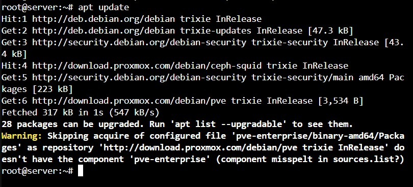
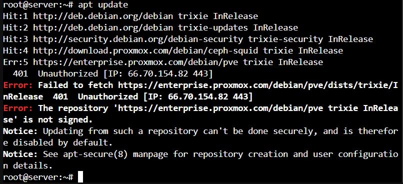
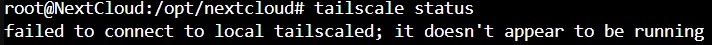
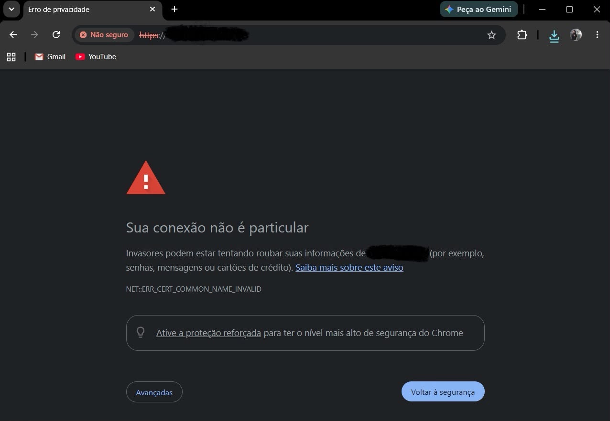
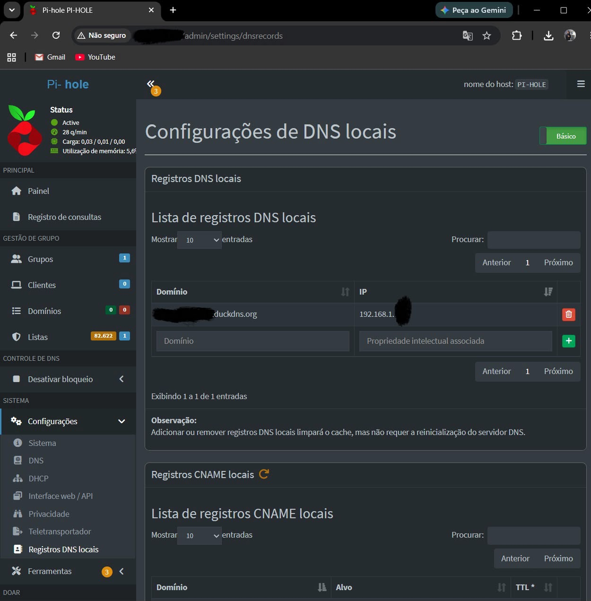
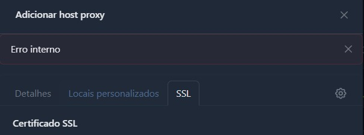
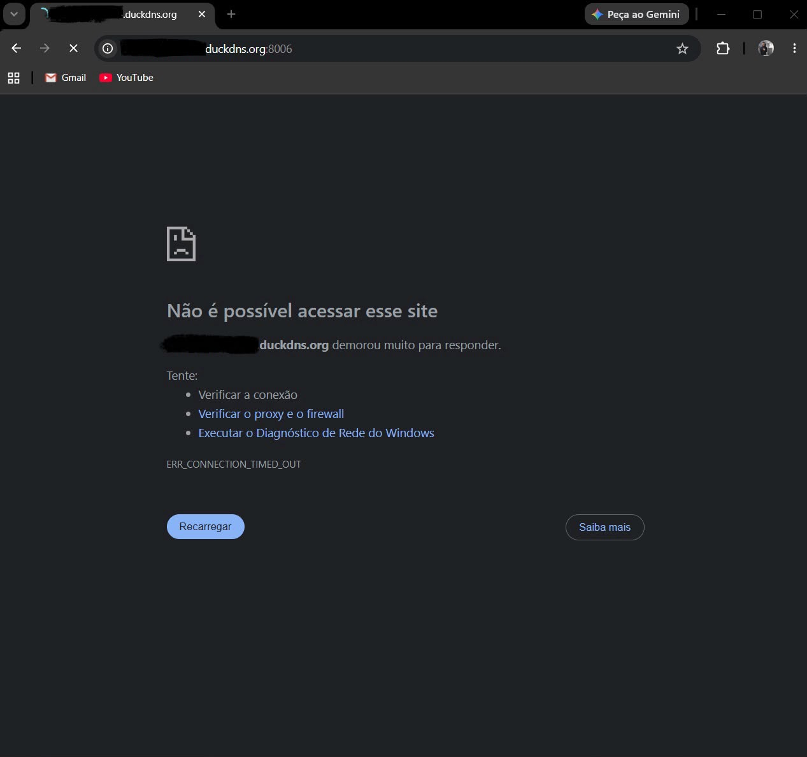

# 🏛️ Meu Homelab: Como montei minha Nuvem Privada com Proxmox, Docker e Tailscale

## 📝 Sobre o Projeto
Este projeto documenta a montagem e a configuração do meu Homelab residencial. O objetivo principal foi criar uma alternativa segura e gratuita aos serviços de nuvem pagos (como Google Drive e iCloud) para usar com a minha família, aplicando na prática conceitos de virtualização, redes e segurança que estudo na faculdade.

---

## 🛠️ Fase 1: Escolha do Hardware (Custo-Benefício)

Como o orçamento estava curto para começar o laboratório, garimpei peças usadas e montei o setup na plataforma LGA1150 com memórias DDR3. Como o foco em virtualização exige bastante memória, priorizei uma placa com boa capacidade de expansão.

| Componente | Peça Selecionada | Por que escolhi? | Valor |
| :--- | :--- | :--- | :--- |
| **Processador** | Intel Core i7-4770K | Já possui vídeo integrado (Intel HD 4600), o que me poupou de gastar com uma placa de vídeo dedicada e reduziu o consumo de energia. | R$ 500,00 |
| **Placa-Mãe** | Gigabyte GA-B85M-DASH | Escolhi este modelo por ter 4 slots de memória RAM, facilitando upgrades futuros. | (Incluso no kit) |
| **Memória RAM**| 16GB DDR3 (2x4GB 1333MHz + 2x4GB 1600MHz) | Capacidade suficiente para dividir os recursos entre os primeiros containers do sistema. | (Incluso no kit) |
| **SSD (Sistema)** | Samsung EVO 870 500GB | Comprei no Marketplace. É o armazenamento principal onde fica o sistema operacional e os sistemas dos containers para garantir velocidade. | R$ 180,00 |
| **HD (Arquivos)** | WD Purple 4TB | Consegui com um amigo. É um disco feito para rodar 24/7, perfeito para guardar os arquivos pesados e os backups da nuvem. | R$ 600,00 |
| **Fonte** | OEM Dell 800W | Eu já tinha essa fonte guardada. Como os cabos originais eram muito curtos, fiz o retrabalho de soldar fios maiores, isolando tudo com fita termoretrátil para garantir a segurança elétrica. | R$ 0,00 |
| **Gabinete** | Modelo ATX Antigo | Ganhei de doação. Fiz o reparo no botão Power que estava quebrado e organizei todo o hardware dentro dele. | R$ 0,00 |

---

## 🚀 Fase 2: Instalação e Configuração de Base

1. **Instalação do Proxmox:** Baixei a ISO oficial do Proxmox VE e fiz a instalação direta no SSD de 500GB.
2. **Configuração de IP:** Defini um IP estático para o servidor e, dentro do painel do meu roteador de internet, fiz a reserva de DHCP (DHCP Reservation) vinculada ao MAC Address da placa-mãe. Isso evita que o servidor mude de IP ou sofra conflitos na rede local.

---

## 📦 Fase 3: Criação dos Containers e Serviços

### 3.1 Bloqueador de Anúncios na Rede (Pi-Hole)
* Criei o meu primeiro Linux Container (LXC) rodando Debian 12 e instalei o Pi-Hole.
* Ele funciona como o servidor de DNS da minha casa, bloqueando propagandas e rastreadores em todos os dispositivos da rede local.
* **Ajuste no Roteador:** Para funcionar 100%, configurei o IP do Pi-Hole no IPv4 do roteador e precisei **desativar o IPv6**. Descobri que os celulares davam prioridade para o IPv6 da operadora, fazendo um *bypass* (desvio) que impedia o Pi-Hole de filtrar os anúncios.

### 3.2 Nuvem Pessoal (Nextcloud + Docker)
* Criei o segundo container LXC (Debian 12), instalei o Docker e subi o Nextcloud usando o `docker-compose`.
* **Gerenciamento do HD de 4TB:** Ao invés de criar partições rígidas no HD para cada serviço, preferi criar pastas dentro dele e apontá-las direto para os containers usando volumes do Linux. Dessa forma, as aplicações compartilham o espaço livre do disco de forma dinâmica, evitando que falte espaço em uma partição enquanto sobra em outra.
* **Controle de Acesso:** Configurei contas separadas para mim e para a minha esposa usarmos no dia a dia. Nenhum desses perfis tem permissão de administrador, o que protege o sistema caso um dos celulares seja comprometido.

### 3.3 Servidor Web e Proxy Reverso (Nginx Proxy Manager)
* **O que é e para que serve:** O Nginx Proxy Manager (NPM) foi implementado como o cérebro de rotas da minha infraestrutura web. A sua principal finalidade é atuar como um *Proxy Reverso*, interceptando todas as requisições que chegam à rede local e direcionando-as inteligentemente para os seus respectivos containers com base no subdomínio digitado (ex: encaminhar a URL do Nextcloud para o container correto sem expor portas bagunçadas).
* **Otimização de Recursos e Rede (`nginx.conf`):** Para garantir o máximo desempenho e estabilidade do proxy dentro do ambiente virtualizado, apliquei parametrizações customizadas no arquivo de configuração principal (`nginx.conf`). Ajustei os limites de conexões simultâneas por processo (`worker_connections`) e o mapeamento de buffers de rede para suportar picos de requisições e downloads pesados na nuvem privada sem estourar a memória RAM do container.
* **Gerenciamento de Certificados:** Configuração do módulo Let's Encrypt integrado com a API do DuckDNS através do **Desafio DNS (DNS Challenge)**. Isso permite que o NPM automatize a emissão e a renovação de certificados SSL válidos (`HTTPS`) para os serviços internos, garantindo tráfego criptografado e seguro dentro do Homelab.

### 3.4 Servidor de Git Privado (Gitea + Docker)
* **Finalidade:** Instalação e provisionamento do **Gitea** rodando via Docker dentro de um container dedicado. O objetivo principal deste serviço é centralizar, versionar e organizar localmente todos os meus códigos e repositórios da faculdade (ADS) e projetos pessoais.
* **Vantagens:** Garante total privacidade dos códigos-fonte dentro da minha própria infraestrutura residencial, funcionando de forma leve, rápida e com consumo mínimo de hardware, simulando o ambiente de trabalho de plataformas como GitHub e GitLab.

---

## 🛡️ Fase 4: Segurança e Blindagem do Servidor

### 4.1 Acesso Externo Seguro com Tailscale
Para podermos acessar o Nextcloud na rua (pelo 5G) ou em viagens para fazer backup das fotos, integrei a rede do Tailscale. Isso me permitiu acessar o servidor de qualquer lugar do mundo **sem precisar abrir portas no roteador de casa**, mantendo o Homelab invisível para invasores da internet.

### 4.2 Resolvendo o problema do aplicativo no iPhone (iOS + HTTPS)
> ⚠️ **O Problema:** Durante os testes, notei que conseguia acessar o Nextcloud pelo navegador usando o 5G, mas o aplicativo oficial do Nextcloud no iPhone dava erro e não conectava de jeito nenhum usando o IP da VPN. 
* **A Causa:** O sistema iOS exige que os aplicativos mobile se conectem apenas através de links criptografados (`HTTPS`) com certificados válidos. Como o Docker roda em `HTTP` comum (porta 80), o iPhone bloqueava o acesso.
* **A Solução:** Usei o recurso **Tailscale Serve** dentro do container para criar um *Proxy Reverso* automático. O Tailscale gerou um domínio próprio (`.ts.net`) e injetou os certificados TLS de forma nativa. Depois, editei o arquivo `config.php` do Nextcloud para aceitar esse novo domínio nas linhas de `trusted_domains`, `overwritehost` e `trusted_proxies`. O app do iPhone passou a funcionar na hora.

### 4.3 Defesa Ativa e Autenticação
* **Dois Fatores (MFA):** Ativei a autenticação em duas etapas (TOTP) por aplicativo de celular nos painéis do Nextcloud e do Proxmox.
* **Bloqueio de Senhas no SSH:** No terminal, gerei um par de chaves criptográficas `ED25519` no Windows e enviei a chave pública para o Proxmox através de comandos de *pipe* no CMD. Depois, acessei o arquivo `/etc/ssh/sshd_config` e mudei a linha `PasswordAuthentication` para `no`. Agora, o terminal do servidor **não aceita senhas**, só entra quem tiver a chave digital salva no computador.
* **Fail2Ban:** Instalação do serviço `fail2ban` no Proxmox para monitorar tentativas suspeitas de login e bloquear o IP do atacante direto no firewall caso aconteça um ataque de força bruta.

---

## 🛠️ Erros que enfrentei e como resolvi (Troubleshooting)

### 1. Erro de Repositório no Proxmox (Erro 401 Unauthorized)
* **O que aconteceu:** Ao tentar rodar o comando `apt update` para instalar o `fail2ban`, o Proxmox retornava erro 401 e bloqueava o download.





* **Como resolvi:** Descobri que, por padrão, ele tenta buscar atualizações nos servidores pagos (Enterprise). Como as versões mais novas usam o formato de arquivos unificados do Debian (padrão `.sources`), abri o arquivo `/etc/apt/sources.list.d/pve-enterprise.sources` e alterei as linhas para apontar para o repositório gratuito da comunidade (`pve-no-subscription`).

### 2. Falha no Driver TUN dentro do Container LXC
* **O que aconteceu:** O serviço do Tailscale não iniciava dentro do container do Nextcloud, apresentando erro de conexão local com o daemon.



* **Como resolvi:** Containers LXC comuns não têm permissão para criar placas de rede virtuais diretamente no Kernel do sistema. Para resolver, acessei o terminal principal do Proxmox, abri o arquivo de configuração do container (`/etc/pve/lxc/101.conf`) e adicionei linhas dando permissão explícita de leitura e escrita para o dispositivo `/dev/net/tun`.

### 3. Erro de Certificado Inválido (HTTPS) no Painel do Proxmox VE
* **O que aconteceu:** Ao tentar acessar a interface de gerenciamento do Proxmox através do navegador, o sistema exibia um aviso crítico de privacidade (`NET::ERR_CERT_COMMON_NAME_INVALID`), apontando que a conexão não era particular.



* **A Causa:** Por padrão, o Proxmox gera um certificado autoassinado (Self-Signed) durante a instalação básica. Como esse certificado não é emitido por uma Autoridade Certificadora (CA) confiável de internet, os navegadores modernos bloqueiam o acesso direto por segurança.
* **Como resolvi:** 1. No painel do **Pi-hole** (menu *Local DNS -> DNS Records*), criei uma entrada de DNS local apontando o subdomínio correspondente de forma absoluta diretamente para o IP estático mapeado do Proxmox.
  
  
  
 2. Para o Proxmox VE, a validação foi feita de forma nativa utilizando a ferramenta de automação ACME integrada ao próprio painel do hipervisor, gerando um certificado Let's Encrypt válido e desvinculado de proxies externos. Já para os demais containers da infraestrutura, implementei o **Nginx Proxy Manager** como um ponto central da infraestrutura. Ele intercepta as requisições dos subdomínios e injeta certificados válidos gerados via Let's Encrypt (DNS Challenge com DuckDNS). Com isso, conseguimos acessar todos os containers via web através de subdomínios dedicados, com criptografia ativa e sem nenhum erro de segurança.

---

### 4. Erro Interno (Internal Error) na Geração de SSL do Nginx Proxy Manager
* **O que aconteceu:** Ao tentar configurar o Proxy Host para o painel administrativo do próprio Nginx Proxy Manager utilizando o desafio DNS para emitir um certificado inédito, a interface gráfica da aplicação travava e retornava uma mensagem genérica de "Internal Error".



* **A Causa:** O NPM gera um conflito de loopback e escuta ao tentar requisitar, validar via DNS e aplicar uma regra de proxy e um novo certificado criptográfico na sua própria porta de gerência administrativa de forma simultânea.
* **Como resolvi:** Em vez de realizar o processo diretamente pela aba de criação do Proxy Host, contornei o problema isolando as etapas: acessei primeiramente a aba superior **SSL Certificates**, criei e emiti o certificado Let's Encrypt de forma independente através do DNS Challenge. Com o certificado gerado com sucesso e listado no sistema, retornei ao menu de *Proxy Hosts* e apenas associei o certificado existente à regra do subdomínio, eliminando o looping e salvando a configuração imediatamente.

---

### 5. Instabilidade de Carregamento e Time Out no Navegador (Cache Zumbi)
* **O que aconteceu:** Logo após reconfigurar as tabelas de rotas e amarrar o certificado correto, o navegador passou a retornar um erro de tempo limite esgotado (`ERR_CONNECTION_TIMED_OUT`) na porta `8006`, recusando-se a abrir a página.



* **A Causa:** O cache de DNS local da máquina cliente (Windows) continuava guardando a rota antiga ou tentando forçar uma requisição anterior sem o redirecionamento correto em background.
* **Como resolvi:** Abri o Prompt de Comando (CMD) como Administrador e executei o comando de limpeza de cache de rede:
  ```cmd
  ipconfig /flushdns

---


## 🔮 Próximas Implementações (Meu Planejamento)

### 💻 Laboratório de Desenvolvimento de Software (ADS)
- [ ] **Ambientes Isolados:** Instalar o servidor web Nginx e bancos de dados (PostgreSQL/MariaDB) para hospedar meus projetos de programação, separando tudo em ambientes de Desenvolvimento, Teste e Produção.
- [x] **Git Privado:** Instalar o Gitea para gerenciar, versionar e organizar localmente os códigos das matérias da faculdade e projetos pessoais.

### 📊 Observabilidade e Continuidade (Backups)
- [ ] **Monitoramento:** Configurar Prometheus e Grafana para criar painéis (dashboards) visuais e acompanhar o uso de memória RAM, processador e rede do servidor.
- [ ] **Rotina de Backups:** Criar um plano de backup automático para as máquinas virtuais, arquivos do Nextcloud e fotos da família no HD de 4TB, testando cenários de restauração completa caso o sistema falhe.

### 🛡️ Laboratório de Cibersegurança (Sandbox)
- [ ] **Rede Isolada de Testes:** Criar um ambiente de rede totalmente isolado dentro do Proxmox para estudar segurança ofensiva e defensiva de forma segura.
- [ ] **Máquinas de Estudo:** Provisionar VMs com Kali Linux, Ubuntu Server e ambientes vulneráveis de propósito (como Metasploitable e OWASP Broken Web Apps).
- [ ] **Estudos Práticos:** Praticar o uso de ferramentas essenciais do mercado (Nmap, Wireshark, Burp Suite, Metasploit) e aplicar técnicas de *Hardening* (endurecimento de segurança) em sistemas operacionais e Firewalls, documentando todos os testes.

### 🤖 Automação Residencial & Infraestrutura Física
- [ ] **Home Assistant:** Subir um container dedicado para o Home Assistant para gerenciar a integração de lâmpadas, tomadas inteligentes, sensores e câmeras da casa.
- [ ] **Upgrades de Hardware:** Expandir a memória RAM para o limite físico de 32GB (aproveitando os 4 slots da placa-mãe), adicionar mais um HD dedicado exclusivamente para os backups e instalar um Nobreak para proteger o Homelab contra quedas de energia.